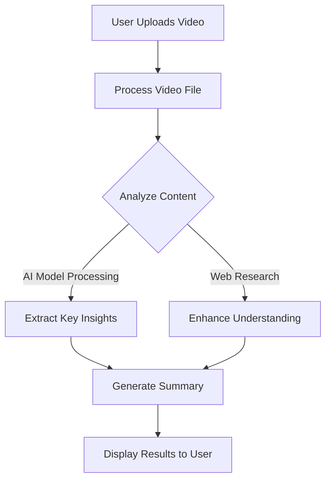

# 🎥 Video Summarizer AI App

## 📝 Description

The **Video Summarizer AI App** is a powerful Streamlit-based application that utilizes **Google Gemini 2.0 Flash Exp** to analyze video content and provide insights based on user queries. The app leverages **LLM-powered video processing** to extract meaningful summaries, detect key insights, and enhance understanding through supplementary web research.

## ✨ Features

- 🎞 **Upload and Analyze Videos** (MP4, MOV, AVI, etc.)
- 🤖 **AI-Powered Summarization** with Google Gemini 2.0 Flash Exp
- 🔎 **User Query-Based Analysis** for extracting key insights
- 🌐 **Web Research Integration** for contextual understanding
- 🚀 **Fast and Efficient Processing**
- 📜 **Detailed and Actionable AI-Generated Responses**

## 🚀 Getting Started

### Prerequisites

- Python 3.8 or higher
- Google API Key
- Git
- Required Python libraries (Streamlit, Phi-Agent, Google Generative AI, DuckDuckGo, dotenv)

### Installation

1. **Clone the repository**
```bash
git clone https://github.com/YOUR_USERNAME/video-summarizer-ai.git
cd video-summarizer-ai
```

2. **Create and activate a virtual environment**
```bash
# Windows
python -m venv venv
venv\Scripts\activate

# Linux/Mac
python -m venv venv
source venv/bin/activate
```

3. **Install dependencies**
```bash
pip install -r requirements.txt
```

4. **Set up environment variables**
Create a `.env` file in the project root:
```plaintext
GOOGLE_API_KEY=your_google_api_key_here
```

5. **Run the application**
```bash
streamlit run app.py
```

## 💻 Usage

1. Upload a video file (**MP4, MOV, AVI, etc.**)
2. Enter a query specifying what insights you need from the video
3. Click **"Analyze Video"** to let the AI process and summarize the content
4. View AI-generated responses and insights

## 🛠️ Technical Architecture



## 📂 Project Structure

```
video-summarizer-ai/
├── app.py              # Main application file
├── .env                # Environment variables
├── requirements.txt    # Dependencies
├── README.md           # Documentation
└── assets/             # Store sample video files and other resources
```

## 🔮 Future Advancements

- 🏷 **Automatic Scene Detection** to highlight key segments
- 🎤 **Speech-to-Text Transcription** for better content analysis
- 🏆 **Sentiment Analysis** of video content
- 🌎 **Multi-Language Support** for diverse users
- 📊 **Visualization of Key Moments** using interactive charts
- 🎯 **Personalized Summaries** based on user preference

## 🤝 Contributing

1. Fork the repository
2. Create a feature branch (`git checkout -b feature/new-feature`)
3. Commit changes (`git commit -m 'Add new feature'`)
4. Push to the branch (`git push origin feature/new-feature`)
5. Open a Pull Request

## 🙏 Acknowledgments

- **Google Gemini AI** for advanced video processing
- **Streamlit** for the web interface
- **Phi-Agent & DuckDuckGo** for AI-driven search enhancements

---

This README now accurately represents your **Video Summarizer AI App** with clear documentation. Let me know if you need any changes! 🚀

